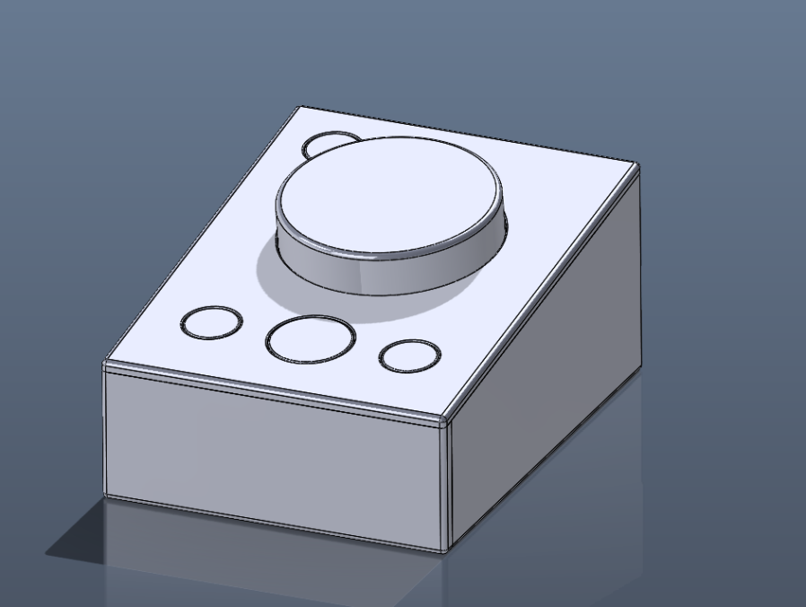
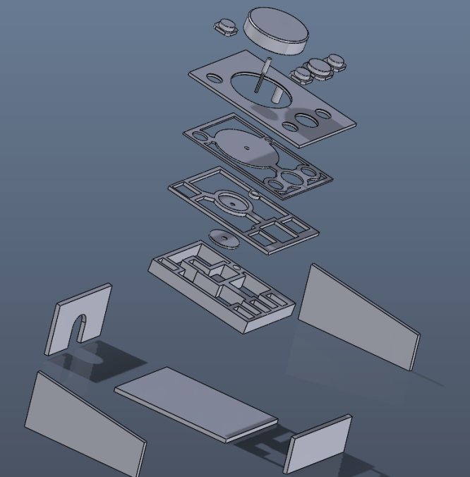

# MediaController

Repurposes an old mouse into a multimedia controller.
Intercepts and blocks events from a specific mouse device
using raw inputs, and replaces them with multimedia commands (Play/Pause, Prev/Next, Volume Up/Down, Mute).

Made with C++ and Win32 API.

### Credits:

Jesse: Helped me design and 3D print a case to house the internals
of the dismantled mouse.

